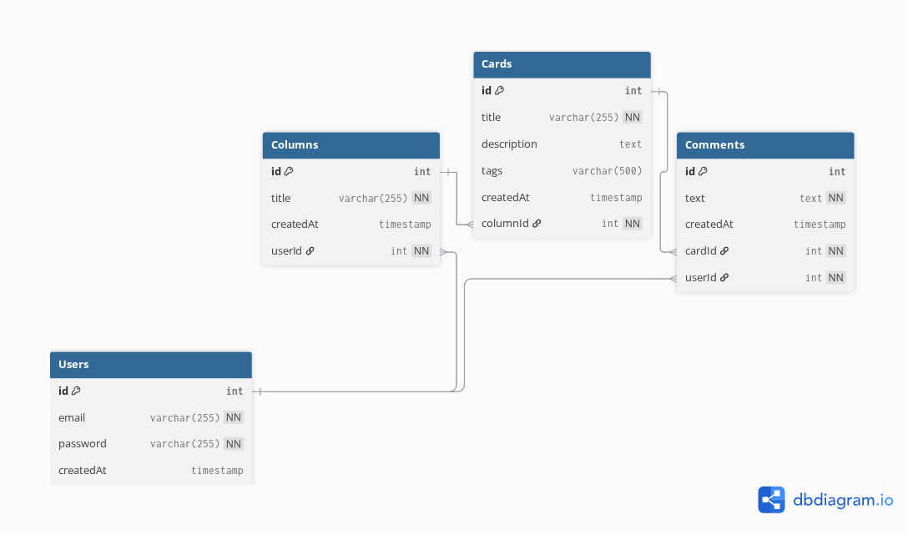

# Trello-like API

Тестовое задание с API, похожим на Trello (˶•𐃷•˶)

## Быстрый старт

1. Клонировать репозиторий (ну... да, тут без этого никак > . >)
2. Копировать `.env.example` в `.env` и заполнить данными (ключи, пароли и т.д.)
3. Установить зависимости (любимый `npm install`)
4. Запустить docker compose с PostgreSQL (`docker compose up -d`)
5. Запустить саму API-шку (`npm run start:dev`)
6. Открыть Swagger документацию: http://localhost:3000/api

## 🔐 Первые шаги после запуска

1. Зарегистрируйте пользователя через `POST /auth/register`
2. Авторизуйтесь через `POST /auth/login` (получите JWT токен)
3. Используйте токен в Header `Authorization: Bearer <token>`
4. Создавайте колонки, карточки, комментарии!

## ⚠️ Заметка про БД!

Для тестов и быстрой пробы я оставил `synchronize: true` в `src/app.module.ts`. 
В полном здравии и в собственном рассудке понимаю, что стоило воспользоваться миграциями для продакшна. 
Но... так быстрее для тестов, не так ли? ^-^

## 📊 Структура базы данных



### Связи:
- User → Columns (один ко многим)
- Column → Cards (один ко многим)
- Card → Comments (один ко многим)
- User → Comments (один ко многим)

[Посмотреть схему в dbdiagram.io](https://dbdiagram.io/d/68f23e572e68d21b41fc5b15)

## 📝 Значения по умолчанию для `.env`

```env
POSTGRES_USER=trello_user
POSTGRES_PASSWORD=your_password_here  
POSTGRES_DB=trello_db
JWT_SECRET=your_super_secret_jwt_key_here
```

## ✅ Выполненные требования ТЗ

- RESTful API для Trello-like приложения
- JWT авторизация (register/login) 
- PostgreSQL + TypeORM
- 4 сущности с правильными связями
- Полный CRUD для всех сущностей
- Валидация через ValidationPipe
- Guards для проверки прав доступа
- Swagger документация
- Использована БД (PostgreSQL через docker compose)

---

Спасибо за внимание! И доброго дня 𐔌՞. .՞𐦯


